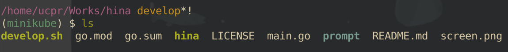

# hina

hina is a shell theme for bash and zsh.

** work in progress **

## Usage

work in progress

## Enviroment Variables

mark to represent git status

| name                 | mark (default) |
|----------------------|----------------|
| `HINA_GIT_MODIFIED`  | `*`            |
| `HINA_GIT_ADDED`     | `+`            |
| `HINA_GIT_DELETED`   | `-`            |
| `HINA_GIT_COPIED`    | `$`            |
| `HINA_GIT_RENAMED`   | `~`            |
| `HINA_GIT_UNMERGED`  | `=`            |
| `HINA_GIT_UNTRACKED` | `%`            |

## Author
taichi uchihara (@u\_chi\_ha\_ra\_)

## LICENCE

MIT LICENCE
